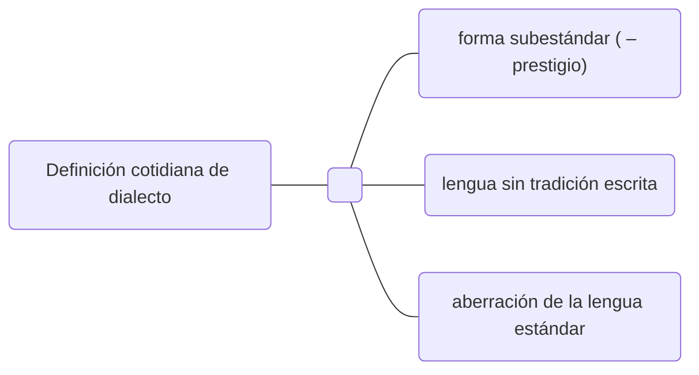

#cuadernonegro #digitalizado #veinticuatro

# Capítulo 1: Lengua y dialecto. 
 

En este libro, «dialecto» no tendrá una connotación de prestigio negativa. 
1) el criterio de **[[inteligibilidad mutua]]** es imperfecta para trazar el límite entre lengua y dialecto.
2) el término **«lengua»** es poco técnico, porque los límites de la lengua están motivados más política que lingüísticamente. Mejor:
	– variedad (entidad lingüística sin nivel de especificidad)
	– acento (variedad diferenciada **fonéticamente**) 
	– ==**[[dialecto]]** (variedad diferenciada fonológica, gramatical y léxicamente)==
3) Los cambios dialectales son geográficamente acumulativos: los dialectos tienden a ser más inteligibles con las comunidades más geográficamente cercanas. Esto genera continuos geolectales, al interior de los cuales no hay límites claros, privativos y discretos, sino cambios graduales que ignoran las fronteras históricas.
4) ==En sociedades modernas, pueden coincidir geográficamente lenguas distintas con distinto grado de prestigio==. Con el desarrollo social e histórico, esto da lugar a un **continuum sociolectal** donde, dependiendo de la situación, un puede elegir un punto intermedio entre dos registros totalmente distintos (inglés y criollo de base inglesa, por ejemplo, como sucede en Jamaica) para adecuar su discurso.
5) , 6) Una «lengua» suele ser entendida como una ==**variedad autónoma** junto con todas las demás que le son heterónomas==. 

# Capítulo 4. Dialectología urbana.

1) En la lingüística comienza a colocarse mucho énfasis en la cuestión geográfica, pero ==«todos los dialectos son tanto espaciales como sociales»==.
2) El enfoque geográfico dificulta el análisis lingüístico urbano. ([[Labov]])
3) , 4) **Labov funda los estudios dialectológicos urbanos**, y descubre **la [[paradoja del observador]]**: a pesar de que el lingüista busca el registro informal por ser el más regular, durante las observaciones el sujeto tenderá a usar los registros formales, especialmente en situación de entrevista.
6)  Variación libre vs variación lingüística.