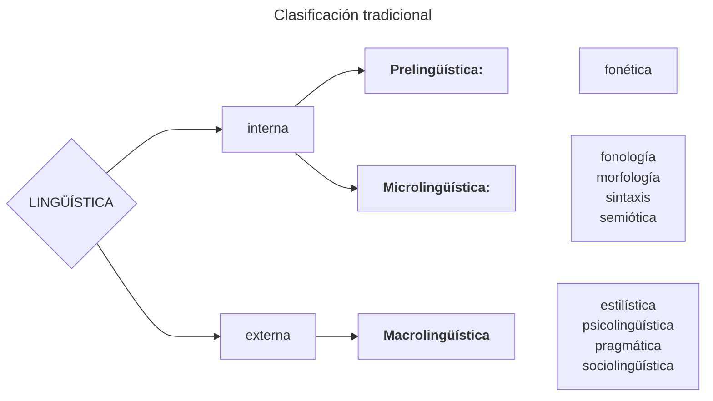

#digitalizado #cuadernonegro 
# Capítulo I

**[[sociolingüística]]**: ==ciencia interdisciplinar que se ocupa de las relaciones existentes entre el lenguaje y la sociedad.== Es una rama de la lingüística que mira el lenguaje como fenómeno social y cultural, estudiándolo en situaciones empíricas y contexto social. (1.1)

Fishman diferencia la **macrosociolingüística** (sociología del lenguaje, [[Labov|lingüística laboviana]], dialectología) de la **microsociolingüística** (análisis del discurso, psicología del lenguaje). (1.2.1) Esto también puede haecerse llamar **formalismo/funcionalismo**, o **cartesianismo/hegelianismo**. (ver [[García (1988). Lingüística cartesiana o el método del discurso.]]) (1.2.2) Ambos ejes pueden verse de forma integral. (1.2.3)

La sociolingüística tiene sus bases en la **«revolución cuantitativa»** (o la búsqueda de leyes a través de datos concretos). **«El investigador ha de ser de campo y no de sillón»**. La ciencia será la aplicación de sistemas lógicos al material empírico. _(Por contraste, **el modelo chomskiano se basa en la intuición.**)_ (1.3.1) Asimismo, también nace en un renovado interés por las ciencias sociales (1.3.2) y en una insatisfacción generalizada con las respuestas del estructuralismo y el generativismo, fijados en la microlingüística y que han dejado deliberadamente de lado la heterogeneidad del [[habla]]. (1.3.3)
Uno de los conceptos que rechaza la sociolingüística es el de [[variación libre]] en el estructuralismo tradicional: la idea de que un sonido o unidad lingüística pueda reemplazar a otra sin cambio en el significado del enunciado. ==La sociolingüística, por el contrario, plantea una variación condicionada social y/o contextualmente==. Las variantes deben estudiarse en contexto social, en términos de frecuencia de uso y predominancia. 

# Capítulo II

**Labov basa sus teorías en valores positivistas/realistas.** No obstante, considera que la «lingüística secular» y aquella «de sillón» son complementarias. (2.1) **La sociolingüística es lingüística, no sociología con datos lingüísticos.** (2.2)
[[Rona 1972]]: la sociolingüística presenta tres ejes de estudio: **social, temporal y espacial**. Presentan una aparición cronológica: el análisis diacrónico es fijado por [[Saussure]]; el diatópico es añadido por la [[Dialectología|dialectología tradicional]]; finalmente, sus falencias son finalmente corregidas por la sociolingüísticas y **el análisis diastrático**.

# Capítulo 3

Hay una diferencia entre las disciplinas de la sociolingüística y la de «lenguaje y sociedad». Hay tres relaciones posibles: **influencia de la sociedad en la lengua, influencia de la lengua en la sociedad, y covariación de fenómenos socioculturales y lingüísticos.**

[[Hymes 1974]]: **Tres orientaciones de la sociolingüística**:
* *Lingüística social*: aplicación de la teoría lingüística para la solución de problemas sociales (educación, marginalidad lingüística, políticas lingüísticas);
* *Lingüística socialmente realista*: metodología de investigación realistas para alcanzar objetivos tradicionales. Reconoce la variación como principio teórico, y se basa metodológicamente en la validez empírica. [[Labov]] y [[Lakoff]].
* _Lingüística socialmente constituida_: la lengua se entiende como parte de la conducta comunicativa social. Critica el [[estructuralismo]]. Etnografía de la comunicación, análisis del discurso.

[[Trudgill 1983]]: **Tres objetivos diferentes para la sociolingüística:**
* _Objetivos sociológicos_: actos lingüísticos con fines sociológicos. Etnometodología.
* *Objetivos lingüísticos y sociológicos*: sociología del lenguaje, psicología social del lenguaje, análisis del discurso, lingüística antropológica. 
* *Objetivos lingüísticos*: dialectología tradicional, lingüística secular, geolingüística. 