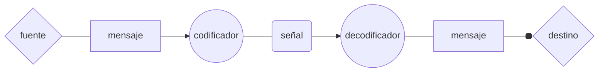

#digitalizado #cuadernonegro #diecinueve
# Capítulo 1. La comunicación.
La comunicación implica la existencia de dos dispositivos de procesamiento de la información: uno modifica el entorno físico del otro. 
* **pensamiento**: *representación contextual*
* **supuesto**: _pensamientos considerados representaciones del mundo real_
* **información**

Históricamente ha existido el **modelo del código**; contemporáneamente se ha propuesto desde la filosofía el **modelo inferencial**. Se pretende que alguna de ambas logre llegar a una teoría unificada de la comunicación; los autores responden que los medios para la comunicación son tan diversos que esto resulta imposible. 

## Modelo del código

**código**: hace posible la comunicación emparejando mensajes y señales.
**mensaje**: representación interna
**señal**: modificación del entorno

No obstante, la noción de código finalmente termina por fracasar al intentar explicar semióticamente estructuras fuera de la lengua, y plantea un vacío entre representación (oración) y el pensamiento detrás del _enunciado_.

## Enunciado y modelo inferencial

**enunciado**: oración + contexto (propiedades no lingüísticas, objeto de la pragmática).
- refleja una **actitud proposicional**
- posee **fuerza ilocutiva** (pensamientos implícitos)

El modelo de código falla al intentar encontrar reglas generalizadas que deduzcan la relación entre el contexto y las partes semánticas de un enunciado; esto lleva al modelo inferencial. 

| **proceso de decodificación** | **proceso inferencial**   |
| ----------------------------- | ------------------------- |
| _mensaje > señal > mensaje_   | _premisas > conclusiones_ |
### Enunciado, contexto y capacidades
El conjunto de premisas o _supuestos_ tras un enunciado es su **contexto**. El contexto contempla la ideología, el entendimiento y la memoria. 
La gramática y las aptitudes para el proceso inferencial son **capacidades fijas** desde la infancia; por el contrario, _el contexto cambia con la experiencia_.
**El contexto plantea un nuevo problema: la existencia de un contexto _real_ y un contexto _previsto_.** Los mecanismos comunicativos no garantizan el éxito de la comunicación (pero tampoco son un sistema perfecto mal aplicado)

### Conocimiento común/mutuo
**Ambos hablantes saben que la otra persona comparte cierta información y, al mismo tiempo, que entiende que ese conocimiento es mutuo.** Sin embargo, esto se puede ver siempre como una incertidumbre. EL esfuerzo explícito por evidenciar estos conocimientos es la excepción. No hay indicios que demuestren que se realice un esfuerzo por asegurar el conocimiento mutuo.
Asimismo, la posible diferencia en perspectiva o experiencia hace toda «suposición de suposiciones» inútil: «el individuo se equivocaría al dar por supuesto el conocimiento mutuo». 
El problema del conocimiento mutuo es que plantea un hecho determinado: los hablantes deben saber de este conocimiento algo que en la práctica jamás se da. 
La hipótesis del conocimiento mutuo establece el grupo de contextos potencialmente utilizables, pero no explica cómo se da esa selección. Mientras desconozcamos este proceso, no tiene sentido adoptar la hipótesis. No hay pruebas de que los hablantes distingan los conocimientos que son mutuos. 

# Capítulo 3. La relevancia.

__«A medida que un discurso avanza, el oyente recupera o construye y luego procesa una serie de _supuestos_. ==Estos supuestos forman un trasfondo gradualmente cambiante contra el que se procesa nueva información.==»__ A esto los autores lo llamarán «efecto contextual», y la relevancia se da en relación con ese trasfondo de supuestos. 
==Relevancia:==
1) ==esfuerzo cognitivo de procesamiento== (_pasos inferenciales_)
2) ==efecto contextual producido== (_implicaciones contextuales_)

Conjunto inicial de supuestos: memoria, conocimiento enciclopédico, deíxis

Un nuevo supuesto que entra en el discurso es **irrelevante** cuando carece de efecto contextual. Eso se da cuando:
1) el supuesto aporta nueva información pero esa información no tiene conexión con la información ya presente en el contexto;
2) el supuesto ya está presente en el contexto;
3) el supuesto es incoherente con el contexto.
Cuando cualquiera de estas tres situaciones ocurre, la fuerza del enunciado es demasiado débil para producir cualquier tipo de cambio en el contexto: en otras palabras, carece de efecto contextual. e